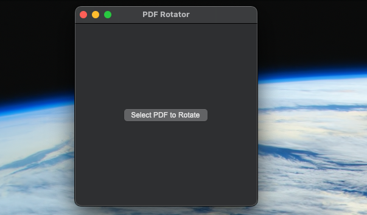
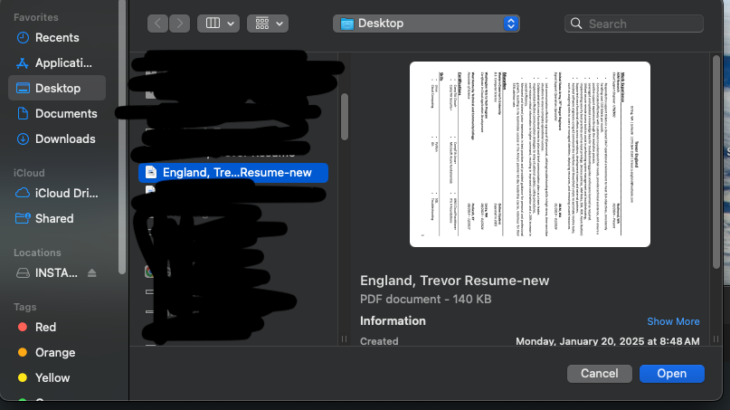
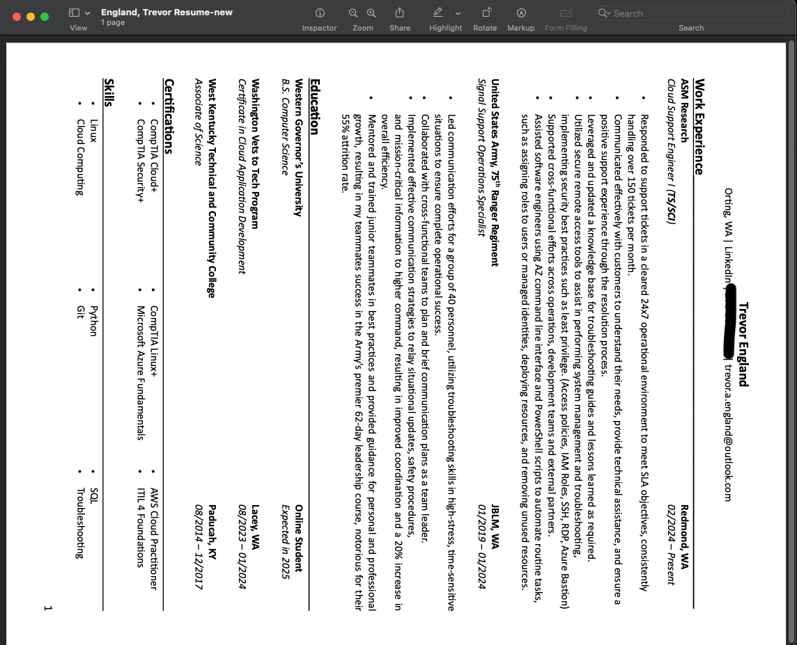
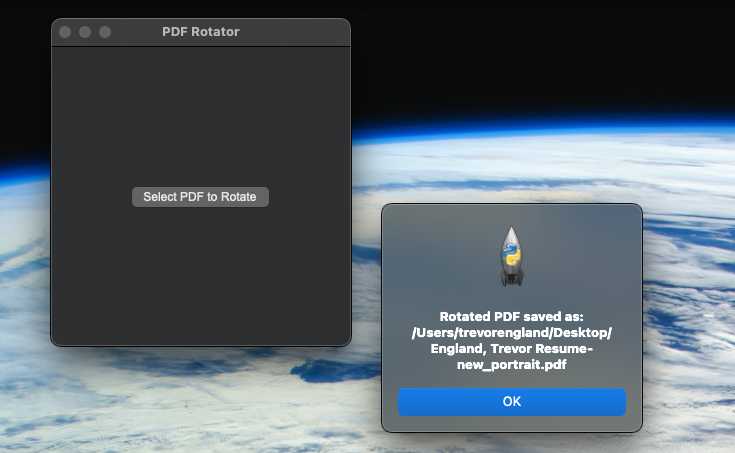
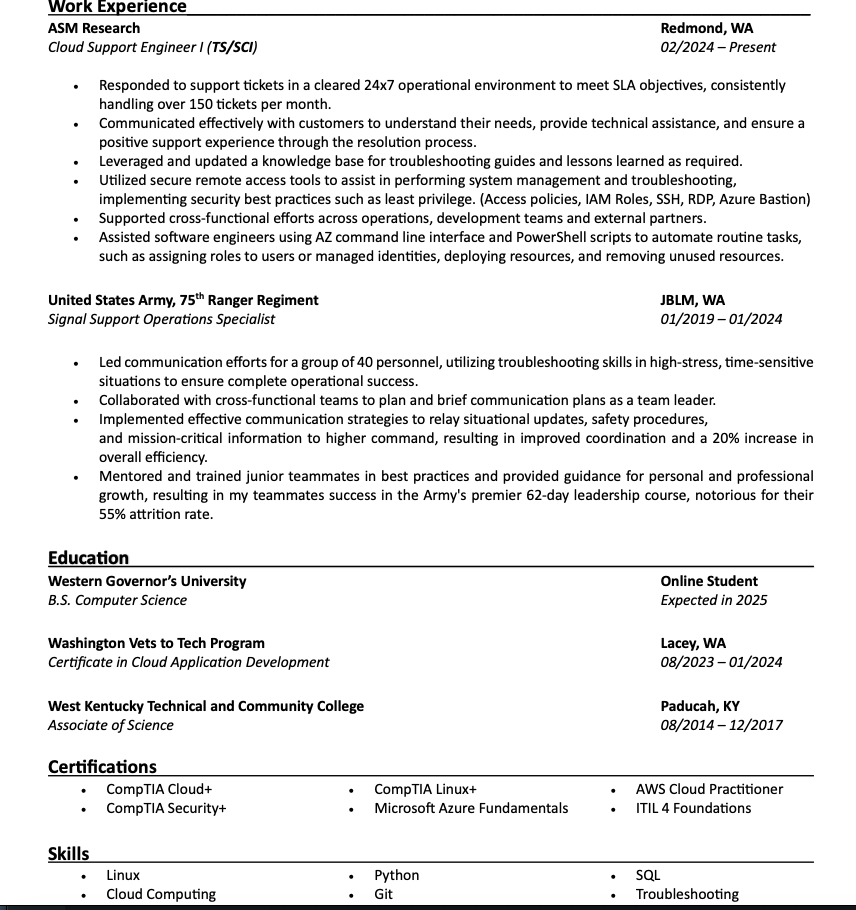

# PDF-Rotator
Rotate any PDF file within your file system to be in portrait mode. I got this idea watching my wife rotate 48 pages of PDF's that someone sent her sideways.  

## Steps to Use Application  

1. Clone this repository.  
    ```bash
    git clone https://github.com/TrevorEngland23/PDF-Rotator
    ```  

2. Navigate to where you cloned the repository.  
    ```bash
    cd /path/to/repository
    ```  

3. Ensure you have Python installed with all libraries/dependencies.  
    ```bash
    python --version
    # Install python if not installed
    pip install PyPDF2
    pip install tkinter
    ```  

4. Execute the program.  
    ```bash
    python PDF_Rotator.py
    ```  

    **Proof of Concept**  

    Upon execution, a small window will appear.  
      

    Select the PDF that needs to be rotated.  
    
      

    Rotate the PDF  
      
      
